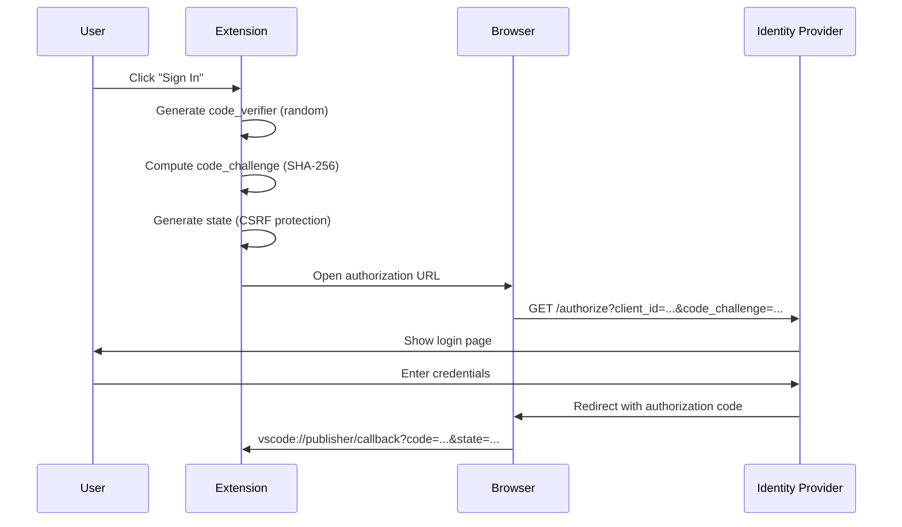
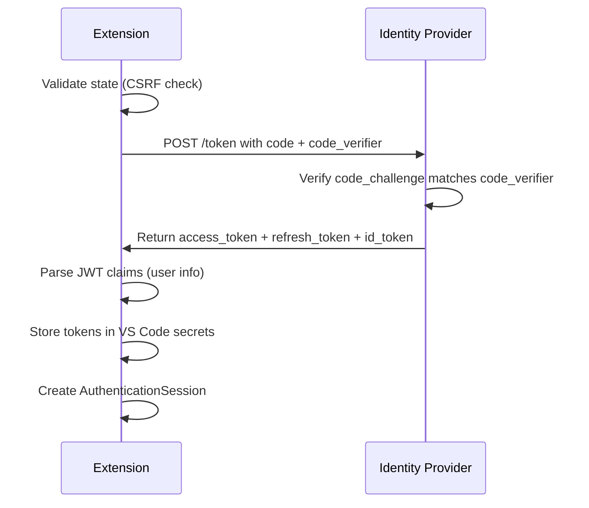
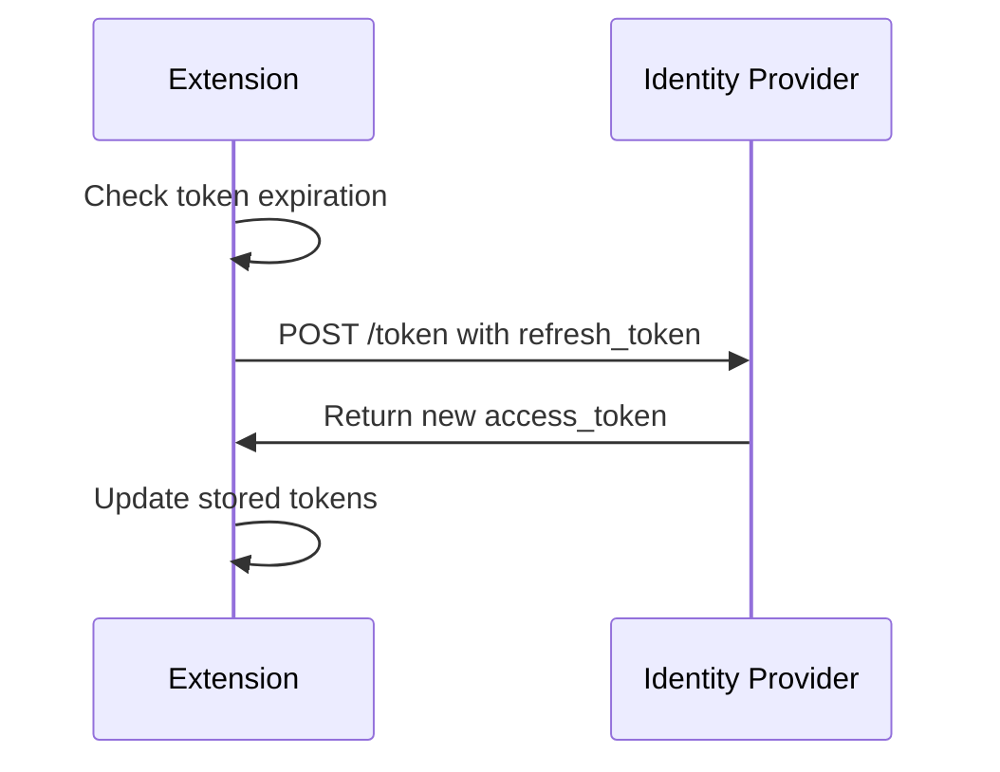

# OAuth2 + PKCE Implementation

This document describes the OAuth2 + PKCE authentication flow implemented for the dummy authentication provider.

## Overview

The implementation follows industry standards for OAuth2 authentication with PKCE (Proof Key for Code Exchange):

- **RFC 6749**: OAuth 2.0 Authorization Framework
- **RFC 7636**: Proof Key for Code Exchange (PKCE)
- **OpenID Connect**: For user identity claims

The implementation is **provider-agnostic** and works with any compliant OAuth2 identity provider including:
- AWS Cognito
- Auth0
- Okta
- Azure AD (Microsoft Entra ID)
- Google Identity
- Any RFC 6749 compliant OAuth2 provider

## Architecture

### Components

1. **oauth.ts** (`src/util/vs/base/common/oauth.ts`)
   - OAuth2 type definitions from VS Code core
   - Interfaces for server metadata, token responses, JWT claims
   - JWT parsing utilities

2. **pkce.ts** (`src/util/common/pkce.ts`)
   - PKCE utility functions
   - Code verifier generation (43-128 characters)
   - Code challenge computation (SHA-256, base64url)
   - State and nonce generation for CSRF protection

3. **oauth2Service.ts** (`src/extension/dummyAuth/common/oauth2Service.ts`)
   - Core OAuth2 business logic
   - Authorization URL building with PKCE parameters
   - Authorization code exchange
   - Token refresh
   - Token revocation
   - User info extraction from JWT tokens

4. **dummyAuthProvider.ts** (`src/extension/dummyAuth/vscode-node/dummyAuthProvider.ts`)
   - VS Code `AuthenticationProvider` implementation
   - OAuth2 flow orchestration
   - Browser redirect handling
   - URI callback handling
   - Token storage using VS Code secrets API
   - Session management

5. **dummyProvidersContribution.ts** (`src/extension/dummyProviders/vscode-node/dummyProvidersContribution.ts`)
   - Dependency injection setup
   - OAuth2 configuration
   - Provider registration
   - URI handler registration

## OAuth2 Flow

### 1. Authorization Request



### 2. Token Exchange



### 3. Token Refresh



## Configuration

### Environment Variables

Configure your OAuth2 provider using environment variables:

```bash
# Required
export OAUTH_CLIENT_ID="your-client-id"
export OAUTH_ISSUER="https://your-idp.com"
export OAUTH_AUTH_ENDPOINT="https://your-idp.com/oauth2/authorize"
export OAUTH_TOKEN_ENDPOINT="https://your-idp.com/oauth2/token"

# Optional
export OAUTH_CLIENT_SECRET="your-client-secret"  # For confidential clients
export OAUTH_REVOCATION_ENDPOINT="https://your-idp.com/oauth2/revoke"
```

### Provider Examples

#### AWS Cognito

```typescript
{
  clientId: "your-cognito-client-id",
  serverMetadata: {
    issuer: "https://cognito-idp.region.amazonaws.com/poolId",
    authorization_endpoint: "https://your-domain.auth.region.amazoncognito.com/oauth2/authorize",
    token_endpoint: "https://your-domain.auth.region.amazoncognito.com/oauth2/token",
    revocation_endpoint: "https://your-domain.auth.region.amazoncognito.com/oauth2/revoke",
    response_types_supported: ["code"],
    code_challenge_methods_supported: ["S256"]
  },
  redirectUri: "vscode://github.copilot-chat/oauth/callback",
  scopes: ["openid", "email", "profile"]
}
```

#### Auth0

```typescript
{
  clientId: "your-auth0-client-id",
  serverMetadata: {
    issuer: "https://your-tenant.auth0.com",
    authorization_endpoint: "https://your-tenant.auth0.com/authorize",
    token_endpoint: "https://your-tenant.auth0.com/oauth/token",
    response_types_supported: ["code"],
    code_challenge_methods_supported: ["S256"]
  },
  redirectUri: "vscode://github.copilot-chat/oauth/callback",
  scopes: ["openid", "email", "profile"]
}
```

#### Azure AD (Microsoft Entra ID)

```typescript
{
  clientId: "your-azure-client-id",
  serverMetadata: {
    issuer: "https://login.microsoftonline.com/tenant-id/v2.0",
    authorization_endpoint: "https://login.microsoftonline.com/tenant-id/oauth2/v2.0/authorize",
    token_endpoint: "https://login.microsoftonline.com/tenant-id/oauth2/v2.0/token",
    response_types_supported: ["code"],
    code_challenge_methods_supported: ["S256"]
  },
  redirectUri: "vscode://github.copilot-chat/oauth/callback",
  scopes: ["openid", "email", "profile"],
  additionalAuthParams: {
    prompt: "select_account"  // Force account selection
  }
}
```

## Security Features

### PKCE (Proof Key for Code Exchange)

PKCE protects against authorization code interception attacks:

1. **Code Verifier**: 43-128 character random string generated using cryptographic randomness
2. **Code Challenge**: SHA-256 hash of the code verifier, base64url encoded
3. **Challenge Method**: S256 (SHA-256)

```typescript
// Generate PKCE parameters
const codeVerifier = generateCodeVerifier(64);  // 64-char random hex string
const codeChallenge = await generateCodeChallenge(codeVerifier);
// codeChallenge = base64url(sha256(codeVerifier))

// Send code_challenge in authorization request
// Send code_verifier in token exchange request
// IDP verifies: sha256(code_verifier) === code_challenge
```

### State Parameter

The `state` parameter prevents CSRF attacks:

1. Generate random 32-character string before authorization
2. Store in memory for validation
3. Verify state in callback matches stored value
4. Expire flow after 10 minutes

### Nonce Parameter

For OpenID Connect flows, the `nonce` parameter:

1. Binds ID token to client session
2. Prevents replay attacks
3. Validated against ID token claims

### Token Storage

Tokens are stored securely using VS Code's secrets API:

```typescript
// Store tokens
await context.secrets.store('dummyAuth.tokens', JSON.stringify({
  tokenResponse,
  issuedAt: Date.now(),
  sessionId,
  accountId,
  accountLabel
}));

// Retrieve tokens
const json = await context.secrets.get('dummyAuth.tokens');
const data = JSON.parse(json);
```

The secrets API:
- Encrypts data at rest
- Uses OS-level keychain/credential managers when available
- Isolates secrets per extension

## API Reference

### OAuth2Service

#### `buildAuthorizationUrl(): Promise<string>`

Builds the authorization URL with PKCE parameters.

**Returns**: Authorization URL to open in browser

**Flow**:
1. Generate code_verifier (64-char random string)
2. Compute code_challenge (SHA-256 of verifier)
3. Generate state for CSRF protection
4. Generate nonce if OpenID Connect
5. Store flow state for validation
6. Build URL with all parameters

#### `validateCallback(callbackUrl: string): { code: string } | { error: string }`

Validates the OAuth callback and extracts the authorization code.

**Parameters**:
- `callbackUrl`: The callback URI received from the browser

**Returns**:
- Success: `{ code: string }`
- Error: `{ error: string }`

**Validation**:
- Checks for error parameters
- Validates state matches stored value
- Checks flow hasn't expired (10 minute timeout)

#### `exchangeCodeForToken(code: string): Promise<IAuthorizationTokenResponse>`

Exchanges authorization code for access token.

**Parameters**:
- `code`: Authorization code from callback

**Returns**: Token response with access_token, refresh_token, id_token

**Flow**:
1. Build token request with code and code_verifier
2. POST to token endpoint
3. Validate response
4. Return token data

#### `refreshAccessToken(refreshToken: string): Promise<IAuthorizationTokenResponse>`

Refreshes the access token using a refresh token.

**Parameters**:
- `refreshToken`: The refresh token

**Returns**: New token response

#### `shouldRefreshToken(tokenResponse: IAuthorizationTokenResponse, bufferSeconds?: number): boolean`

Checks if a token needs refresh based on expiration.

**Parameters**:
- `tokenResponse`: The token response to check
- `bufferSeconds`: Refresh buffer in seconds (default: 300 = 5 minutes)

**Returns**: `true` if token should be refreshed

#### `getUserInfo(tokenResponse: IAuthorizationTokenResponse): IAuthorizationJWTClaims | undefined`

Extracts user information from JWT tokens.

**Parameters**:
- `tokenResponse`: Token response containing id_token or access_token

**Returns**: JWT claims (sub, email, name, etc.) or undefined

#### `revokeToken(token: string, tokenTypeHint?: 'access_token' | 'refresh_token'): Promise<void>`

Revokes a token at the provider's revocation endpoint.

**Parameters**:
- `token`: Token to revoke
- `tokenTypeHint`: Type hint for the token

## Testing

### Manual Testing

1. **Configure OAuth2 Provider**:
   ```bash
   export OAUTH_CLIENT_ID="test-client-id"
   export OAUTH_ISSUER="https://test-idp.com"
   export OAUTH_AUTH_ENDPOINT="https://test-idp.com/authorize"
   export OAUTH_TOKEN_ENDPOINT="https://test-idp.com/token"
   ```

2. **Start Extension**:
   - Press F5 in VS Code to launch Extension Development Host

3. **Test Sign In**:
   - Click Accounts icon in VS Code
   - Select "Sign in with My Dummy Auth"
   - Browser opens with authorization URL
   - Complete authentication at IDP
   - Browser redirects back to VS Code
   - Session created and stored

4. **Verify Session**:
   - Run command: `GitHub Copilot: Check Dummy Auth Context Key`
   - Should show signed in state
   - Models should be available in chat

5. **Test Token Refresh**:
   - Wait for token to near expiration
   - Request a new session
   - Extension automatically refreshes token

6. **Test Sign Out**:
   - Click Accounts icon
   - Select "Sign out of My Dummy Auth"
   - Tokens revoked and cleared
   - Models no longer available

### Automated Testing

TODO: Add integration tests for OAuth2 flow

## Troubleshooting

### Browser doesn't open

**Issue**: Authorization URL doesn't open in browser

**Solution**:
- Check that `vscode.env.openExternal` succeeded
- Verify authorization URL is valid
- Check firewall/proxy settings

### Callback not received

**Issue**: After authentication, VS Code doesn't receive callback

**Solution**:
- Verify redirect URI matches registered URI: `vscode://github.copilot-chat/oauth/callback`
- Check URI handler is registered
- Ensure no other extensions are intercepting the URI

### State validation fails

**Issue**: "Invalid state" error during callback

**Solution**:
- This indicates a potential CSRF attack or timing issue
- Ensure authorization and callback happen within 10 minutes
- Check that no browser extensions modify the callback URL

### Token exchange fails

**Issue**: Error during code-to-token exchange

**Solution**:
- Verify token endpoint URL is correct
- Check client_id and client_secret (if using confidential client)
- Ensure code_verifier matches code_challenge (PKCE validation)
- Check network connectivity to token endpoint

### Token refresh fails

**Issue**: Cannot refresh expired token

**Solution**:
- Verify refresh_token was provided in initial response
- Check that refresh_token hasn't expired
- Ensure token endpoint supports refresh_token grant type
- User may need to re-authenticate

## Future Enhancements

- [ ] Add VS Code settings UI for OAuth2 configuration
- [ ] Support multiple OAuth2 providers simultaneously
- [ ] Add token caching with automatic background refresh
- [ ] Implement device code flow for headless environments
- [ ] Add comprehensive integration tests
- [ ] Support custom token validation (e.g., audience checks)
- [ ] Add telemetry for authentication metrics
- [ ] Implement automatic retry with exponential backoff
- [ ] Support OAuth2 dynamic client registration
