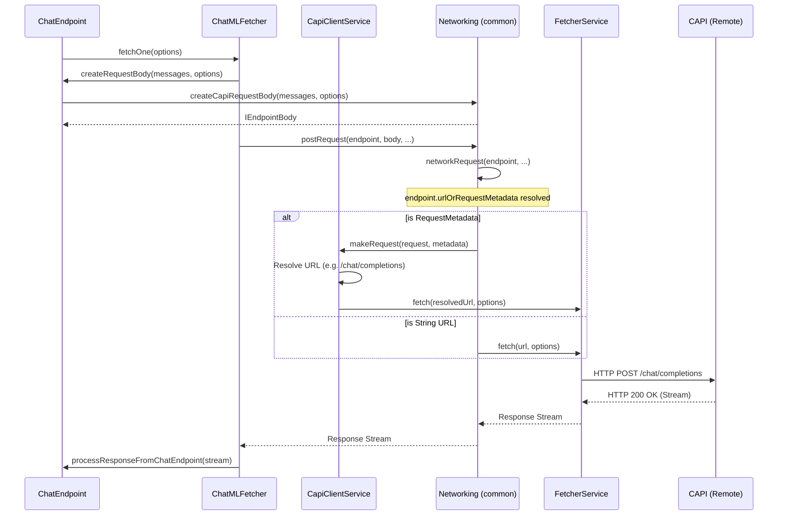

# Language Model Provider API

This document covers how VS Code extensions can provide AI models (like GPT-4, Claude, etc.) to VS Code through the Language Model Provider API.

## Overview

Extensions can supply AI models to VS Code's ecosystem using the `vscode.lm` API. This allows other extensions and built-in features to consume these models through a unified interface.

**Component Breakdown**:
```
┌─────────────────────────────────────────────────────────────────┐
│                       Extension Layer                           │
│  ┌─────────────────────────────────────────────────────────┐   │
│  │   Language Model Provider Extension                     │   │
│  │   (github.copilot)                                      │   │
│  │                                                          │   │
│  │   1. Extension Activation (package.json)                │   │
│  │      - enabledApiProposals: ["languageModels"]          │   │
│  │      - activationEvents: ["onLanguageModelAccess"]      │   │
│  │                                                          │   │
│  │   2. Provider Registration                              │   │
│  │      vscode.lm.registerLanguageModelProvider()          │   │
│  │      - vendor: "copilot"                                │   │
│  │      - family: "gpt-4o"                                 │   │
│  │                                                          │   │
│  │   3. provideLanguageModelChatResponse()                 │   │
│  │      - Implements streaming chat interface              │   │
│  │      - Returns AsyncIterable<string>                    │   │
│  └─────────────────────────────────────────────────────┘   │
└─────────────────────────────────────────────────────────────────┘
                            ↓
┌─────────────────────────────────────────────────────────────────┐
│                    VS Code Core Layer                           │
│  ┌─────────────────────────────────────────────────────────┐   │
│  │   vscode.lm API (Proposed API)                          │   │
│  │                                                          │   │
│  │   - selectChatModels(): Get available models            │   │
│  │   - sendChatRequest(): Send requests to models          │   │
│  └─────────────────────────────────────────────────────┘   │
│                            ↓                                     │
│  ┌─────────────────────────────────────────────────────────┐   │
│  │   LanguageModelStub (VS Code Internal)                  │   │
│  │   - Manages model metadata                              │   │
│  │   - Handles request routing                             │   │
│  │   - Enforces authentication                             │   │
│  └─────────────────────────────────────────────────────┘   │
└─────────────────────────────────────────────────────────────────┘
                            ↓
┌─────────────────────────────────────────────────────────────────┐
│                  Consumer Extensions                            │
│  ┌─────────────────────────────────────────────────────────┐   │
│  │   Chat Participant Extension                            │   │
│  │   (e.g., @workspace, @terminal)                         │   │
│  │                                                          │   │
│  │   const models = await vscode.lm.selectChatModels({     │   │
│  │     vendor: 'copilot',                                  │   │
│  │     family: 'gpt-4o'                                    │   │
│  │   });                                                   │   │
│  │                                                          │   │
│  │   const response = await models[0].sendChatRequest(     │   │
│  │     messages,                                           │   │
│  │     {},                                                 │   │
│  │     token                                               │   │
│  │   );                                                    │   │
│  └─────────────────────────────────────────────────────┘   │
└─────────────────────────────────────────────────────────────────┘
```

## How Provider Registration Works

### Step 1: Extension Declares Capability in package.json

```json
{
  "name": "copilot",
  "enabledApiProposals": [
    "languageModels"
  ],
  "activationEvents": [
    "onLanguageModelAccess:copilot"
  ]
}
```

**Key Points**:
- `enabledApiProposals: ["languageModels"]` - Required to access the Language Model API
- `onLanguageModelAccess:copilot` - VS Code will activate this extension when another extension requests a Copilot model
- The activation event pattern is `onLanguageModelAccess:<vendor>` where `<vendor>` matches the vendor name in the registration

### Step 2: Extension Activates and Registers Provider

When activated, the extension calls `vscode.lm.registerLanguageModelProvider()`:

```typescript
// From github.copilot extension
export async function activate(context: vscode.ExtensionContext) {
  const languageModelToolsExtension = vscode.extensions.getExtension('github.copilot');
  
  // Register the language model provider
  const registration = vscode.lm.registerLanguageModelProvider(
    'copilot',           // vendor
    'gpt-4o',            // family
    languageModelProvider,
    {
      name: 'GPT 4o',
      version: '2024-05-13',
      maxInputTokens: 128000,
      maxOutputTokens: 4096
    }
  );
  
  context.subscriptions.push(registration);
}
```

**Registration Parameters**:
1. **vendor** (string): The vendor/provider identifier (e.g., "copilot", "anthropic")
2. **family** (string): The model family identifier (e.g., "gpt-4o", "claude-3-opus")
3. **provider** (LanguageModelChatProvider): Object implementing the provider interface
4. **metadata** (LanguageModelChatMetadata): Model capabilities and limits

### Step 3: VS Code's LanguageModelsService Manages Registration

When a provider is registered, VS Code's `LanguageModelsService` (from `src/vs/workbench/contrib/chat/common/languageModels.ts`) handles it:

```typescript
// VS Code internal code (actual implementation)
export interface ILanguageModelChatProvider {
  readonly onDidChange: Event<void>;
  provideLanguageModelChatInfo(options: { silent: boolean }, token: CancellationToken): Promise<ILanguageModelChatMetadataAndIdentifier[]>;
  sendChatRequest(modelId: string, messages: IChatMessage[], from: ExtensionIdentifier, options: { [name: string]: any }, token: CancellationToken): Promise<ILanguageModelChatResponse>;
  provideTokenCount(modelId: string, message: string | IChatMessage, token: CancellationToken): Promise<number>;
}

export class LanguageModelsService implements ILanguageModelsService {
  private readonly _providers = new Map<string, ILanguageModelChatProvider>();
  private readonly _modelCache = new Map<string, ILanguageModelChatMetadata>();
  
  registerLanguageModelProvider(vendor: string, provider: ILanguageModelChatProvider): IDisposable {
    // Validate vendor is known from extension point
    if (!this._vendors.has(vendor)) {
      throw new Error(`Chat model provider uses UNKNOWN vendor ${vendor}.`);
    }
    
    // Store provider
    this._providers.set(vendor, provider);
    
    // Resolve models from provider
    await this._resolveLanguageModels(vendor, true);
    
    // Listen for model changes and update cache
    const modelChangeListener = provider.onDidChange(async () => {
      await this._resolveLanguageModels(vendor, true);
    });
    
    return toDisposable(() => {
      this._providers.delete(vendor);
      modelChangeListener.dispose();
    });
  }

  async sendChatRequest(modelId: string, from: ExtensionIdentifier, messages: IChatMessage[], options: { [name: string]: any }, token: CancellationToken): Promise<ILanguageModelChatResponse> {
    // Look up model vendor
    const model = this._modelCache.get(modelId);
    if (!model) {
      throw new Error(`Chat model ${modelId} could not be found.`);
    }
    
    // Get provider for this vendor
    const provider = this._providers.get(model.vendor);
    if (!provider) {
      throw new Error(`Chat provider for model ${modelId} is not registered.`);
    }
    
    // Delegate to provider
    return provider.sendChatRequest(modelId, messages, from, options, token);
  }
}
```

**Key Responsibilities of LanguageModelsService**:
- Stores all registered providers in a map by vendor name
- Maintains model cache indexed by model identifier
- Handles lazy activation of provider extensions when models are requested
- Routes requests to the correct provider based on model ID
- Manages model metadata caching and updates

### Step 4: Consumer Extension Requests Models via selectLanguageModels

Other extensions can discover and use registered models via the `ILanguageModelsService`:

```typescript
// Consumer extension code - requests available models
const modelIds = await vscode.lm.selectChatModels({
  vendor: 'copilot',
  family: 'gpt-4o'
});

if (modelIds.length === 0) {
  throw new Error('No Copilot GPT-4o model available');
}

// Get model metadata for display
const modelId = modelIds[0];
const model = vscode.lm.lookupLanguageModel(modelId);
console.log(`Using model: ${model.name} (${model.version})`);

// Send request to the model
const response = await vscode.lm.sendChatRequest(
  modelId,
  [
    vscode.LanguageModelChatMessage.User('Explain what this code does'),
    vscode.LanguageModelChatMessage.User('function factorial(n) { ... }')
  ],
  {},
  cancellationToken
);

for await (const part of response.stream) {
  console.log(part);
}
```

**What Happens**:
1. `selectLanguageModels()` triggers lazy activation of the provider extension
2. Provider's `provideLanguageModelChatInfo()` is called to populate model cache
3. Matching models are returned to the consumer
4. When `sendChatRequest()` is called, LanguageModelsService routes to the correct provider
5. Provider's `sendChatRequest()` method streams response back

## Complete Registration Flow Diagram

```
┌──────────────────────────────────────────────────────────────────┐
│  1. VS Code Reads Extension Configuration                        │
│     - Parses languageModelChatProviders extension point          │
│     - Registers vendors (e.g., 'copilot', 'anthropic')           │
│     - Does NOT activate provider extensions yet                  │
└──────────────────────────────────────────────────────────────────┘
                              ↓
┌──────────────────────────────────────────────────────────────────┐
│  2. Consumer Extension Requests Models                           │
│     const modelIds = await vscode.lm.selectLanguageModels(       │
│       { vendor: 'copilot' }                                      │
│     )                                                            │
└──────────────────────────────────────────────────────────────────┘
                              ↓
┌──────────────────────────────────────────────────────────────────┐
│  3. LanguageModelsService Checks Extension                       │
│     - Looks for provider in _providers map                       │
│     - If not found, triggers activation event                    │
└──────────────────────────────────────────────────────────────────┘
                              ↓
┌──────────────────────────────────────────────────────────────────┐
│  4. VS Code Fires Activation Event                               │
│     activateByEvent('onLanguageModelChatProvider:copilot')       │
│     - Activates github.copilot extension                         │
└──────────────────────────────────────────────────────────────────┘
                              ↓
┌──────────────────────────────────────────────────────────────────┐
│  5. Provider Extension Registers                                 │
│     export async function activate(context) {                    │
│       const registration =                                       │
│         vscode.lm.registerLanguageModelProvider(                 │
│           'copilot',        // vendor                            │
│           provider           // ILanguageModelChatProvider       │
│         );                                                       │
│       context.subscriptions.push(registration);                  │
│     }                                                            │
└──────────────────────────────────────────────────────────────────┘
                              ↓
┌──────────────────────────────────────────────────────────────────┐
│  6. LanguageModelsService Stores Provider                        │
│     - Stores in _providers map by vendor                         │
│     - Calls provider.provideLanguageModelChatInfo()              │
│     - Caches returned models in _modelCache                      │
│     - Listens to provider.onDidChange event                      │
└──────────────────────────────────────────────────────────────────┘
                              ↓
┌──────────────────────────────────────────────────────────────────┐
│  7. Model Cache Populated                                        │
│     _modelCache = {                                              │
│       "copilot/gpt-4o": { vendor, id, name, capabilities... },  │
│       "copilot/gpt-4o-mini": {...},                              │
│       ...                                                        │
│     }                                                            │
└──────────────────────────────────────────────────────────────────┘
                              ↓
┌──────────────────────────────────────────────────────────────────┐
│  8. Matching Models Returned                                     │
│     selectLanguageModels() filters cache by:                     │
│       - vendor                                                   │
│       - family                                                   │
│       - version                                                  │
│       - id                                                       │
│     Returns: ["copilot/gpt-4o"]                                  │
└──────────────────────────────────────────────────────────────────┘
                              ↓
┌──────────────────────────────────────────────────────────────────┐
│  9. Consumer Sends Request                                       │
│     const response = await vscode.lm.sendChatRequest(            │
│       "copilot/gpt-4o",                                          │
│       messages,                                                  │
│       {},                                                        │
│       token                                                      │
│     )                                                            │
└──────────────────────────────────────────────────────────────────┘
                              ↓
┌──────────────────────────────────────────────────────────────────┐
│  10. LanguageModelsService Routes Request                        │
│      - Looks up model in _modelCache to find vendor              │
│      - Gets provider from _providers by vendor                   │
│      - Calls provider.sendChatRequest(modelId, messages, ...)    │
└──────────────────────────────────────────────────────────────────┘
                              ↓
┌──────────────────────────────────────────────────────────────────┐
│  11. Provider Handles Request                                    │
│      - Authenticates with AI service                             │
│      - Transforms messages to service format                     │
│      - Makes HTTP request                                        │
│      - Streams response back                                     │
└──────────────────────────────────────────────────────────────────┘
                              ↓
┌──────────────────────────────────────────────────────────────────┐
│  12. Response Streams to Consumer                                │
│      for await (const part of response.stream) {                 │
│        console.log(part);  // Real-time output                   │
│      }                                                           │
└──────────────────────────────────────────────────────────────────┘
```

## Model Metadata Fetching

The GitHub Copilot extension dynamically fetches available models from the Copilot API (CAPI) endpoint.

### ModelMetadataFetcher Implementation

```typescript
// src/platform/endpoint/node/modelMetadataFetcher.ts
export class ModelMetadataFetcher {
  private readonly _onDidChangeModelMetadata = new vscode.EventEmitter<void>();
  public readonly onDidChangeModelMetadata = this._onDidChangeModelMetadata.event;
  
  private _cachedModels: LanguageModelChatMetadata[] | undefined;
  private _fetchPromise: Promise<LanguageModelChatMetadata[]> | undefined;
  
  constructor(
    private readonly githubAuthProvider: GitHubAuthProvider,
    private readonly telemetry: TelemetryService
  ) {}
  
  async getModels(): Promise<LanguageModelChatMetadata[]> {
    if (this._cachedModels) {
      return this._cachedModels;
    }
    
    if (!this._fetchPromise) {
      this._fetchPromise = this._fetchModels();
    }
    
    return this._fetchPromise;
  }
  
  private async _fetchModels(): Promise<LanguageModelChatMetadata[]> {
    const token = await this.githubAuthProvider.getCopilotToken();
    
    const response = await fetch('https://api.githubcopilot.com/models', {
      headers: {
        'Authorization': `Bearer ${token}`,
        'Editor-Version': vscode.version,
        'Editor-Plugin-Version': this.pluginVersion,
        'User-Agent': 'github-copilot-vscode'
      }
    });
    
    const data = await response.json();
    
    const models = data.models.map(model => ({
      vendor: 'copilot',
      family: model.id,
      version: model.version,
      name: model.display_name,
      maxInputTokens: model.max_input_tokens,
      maxOutputTokens: model.max_output_tokens,
      capabilities: model.capabilities
    }));
    
    this._cachedModels = models;
    this._onDidChangeModelMetadata.fire();
    
    return models;
  }
}
```

### CAPI /models Endpoint Response

**Request**:
```http
GET https://api.githubcopilot.com/models HTTP/1.1
Authorization: Bearer <copilot_token>
Editor-Version: 1.85.0
Editor-Plugin-Version: 1.143.0
User-Agent: github-copilot-vscode
```

**Response**:
```json
{
  "models": [
    {
      "id": "gpt-4o",
      "display_name": "GPT 4o",
      "version": "2024-05-13",
      "max_input_tokens": 128000,
      "max_output_tokens": 4096,
      "capabilities": ["chat", "function_calling"]
    },
    {
      "id": "gpt-4o-mini",
      "display_name": "GPT 4o mini",
      "version": "2024-07-18",
      "max_input_tokens": 128000,
      "max_output_tokens": 16384,
      "capabilities": ["chat", "function_calling"]
    },
    {
      "id": "o1-preview",
      "display_name": "o1 Preview",
      "version": "2024-09-12",
      "max_input_tokens": 128000,
      "max_output_tokens": 32768,
      "capabilities": ["chat"]
    },
    {
      "id": "claude-3.5-sonnet",
      "display_name": "Claude 3.5 Sonnet",
      "version": "20240620",
      "max_input_tokens": 200000,
      "max_output_tokens": 8192,
      "capabilities": ["chat", "function_calling", "vision"]
    }
  ]
}
```

## Model List Chain

This section describes how the model picklist in the Chat Panel UI is populated, flowing from the VS Code UI through the Core service to the Copilot Extension.

### 1. Extension Contribution (package.json)

The extension declares its language model provider in `package.json`.

```json
// vscode-copilot-chat/package.json
"contributes": {
  "languageModelChatProviders": [
    {
      "vendor": "copilot",
      "displayName": "Copilot"
    }
  ]
}
```

### 2. VS Code Core Registration (LanguageModelsService)

VS Code's `LanguageModelsService` reads the contribution and registers the vendor.

```typescript
// vscode/src/vs/workbench/contrib/chat/common/languageModels.ts
constructor(...) {
  this._store.add(languageModelChatProviderExtensionPoint.setHandler((extensions) => {
    for (const extension of extensions) {
      for (const item of Iterable.wrap(extension.value)) {
        this._vendors.set(item.vendor, item);
        // Activate extension if we have stored models for this vendor
        if (this._hasStoredModelForVendor(item.vendor)) {
          this._extensionService.activateByEvent(`onLanguageModelChatProvider:${item.vendor}`);
        }
      }
    }
  }));
}
```

### 3. Extension Activation & Registration

When activated, the extension registers its provider implementation.

```typescript
// vscode-copilot-chat/src/extension/conversation/vscode-node/languageModelAccess.ts
private async _registerChatProvider(): Promise<void> {
  const provider: vscode.LanguageModelChatProvider = {
    provideLanguageModelChatInformation: this._provideLanguageModelChatInfo.bind(this),
    // ... other methods
  };
  this._register(vscode.lm.registerLanguageModelChatProvider('copilot', provider));
}
```

### 4. UI Requests Models (ChatInputPart)

The Chat UI (`ChatInputPart`) requests the list of available models to display in the picker.

```typescript
// vscode/src/vs/workbench/contrib/chat/browser/chatInputPart.ts
private getModels(): ILanguageModelChatMetadataAndIdentifier[] {
  // Get models from service
  let models = this.languageModelsService.getLanguageModelIds()
    .map(modelId => ({ 
      identifier: modelId, 
      metadata: this.languageModelsService.lookupLanguageModel(modelId)! 
    }));
  return models;
}
```

### 5. LanguageModelsService Resolves Models

If models aren't cached, the service resolves them by calling the provider.

```typescript
// vscode/src/vs/workbench/contrib/chat/common/languageModels.ts
private async _resolveLanguageModels(vendor: string, silent: boolean): Promise<void> {
  // Activate extension
  await this._extensionService.activateByEvent(`onLanguageModelChatProvider:${vendor}`);
  const provider = this._providers.get(vendor);
  
  // Call provider
  let modelsAndIdentifiers = await provider.provideLanguageModelChatInfo({ silent }, CancellationToken.None);
  
  // Update cache
  this._clearModelCache(vendor);
  for (const modelAndIdentifier of modelsAndIdentifiers) {
    this._modelCache.set(modelAndIdentifier.identifier, modelAndIdentifier.metadata);
  }
  this._onLanguageModelChange.fire(vendor);
}
```

### 6. Extension Provides Models

The extension fetches model metadata (e.g., from CAPI) and returns it.

```typescript
// vscode-copilot-chat/src/extension/conversation/vscode-node/languageModelAccess.ts
private async _provideLanguageModelChatInfo(options: { silent: boolean }, token: vscode.CancellationToken): Promise<vscode.LanguageModelChatInformation[]> {
  const session = await this._getToken();
  // ... fetch models from endpoint ...
  const chatEndpoints = (await this._endpointProvider.getAllChatEndpoints())
    .filter(e => e.showInModelPicker || e.model === 'gpt-4o-mini');
    
  return chatEndpoints.map(endpoint => ({
    identifier: endpoint.model,
    metadata: {
      name: endpoint.model,
      family: endpoint.family,
      // ...
    }
  }));
}
```

## Request Execution Chain

When a consumer extension calls `model.sendChatRequest()`, the request flows through multiple layers:

```
┌─────────────────────────────────────────────────────────────────┐
│  Consumer Extension                                             │
│  ─────────────────────                                          │
│  const response = await model.sendChatRequest(                  │
│    [                                                            │
│      LanguageModelChatMessage.User('Explain this code')         │
│    ],                                                           │
│    { temperature: 0.7 },                                        │
│    cancellationToken                                            │
│  );                                                             │
└─────────────────────────────────────────────────────────────────┘
                            ↓
┌─────────────────────────────────────────────────────────────────┐
│  VS Code Core (MainThreadLanguageModels)                        │
│  ────────────────────────────────────────                       │
│  1. Validate authentication                                     │
│  2. Check rate limits                                           │
│  3. Log telemetry                                               │
│  4. Forward to provider extension via RPC                       │
└─────────────────────────────────────────────────────────────────┘
                            ↓
┌─────────────────────────────────────────────────────────────────┐
│  Provider Extension (ExtHostLanguageModels)                     │
│  ───────────────────────────────────────────                    │
│  1. Deserialize request                                         │
│  2. Call provideLanguageModelChatResponse()                     │
│  3. Stream results back to VS Code                              │
└─────────────────────────────────────────────────────────────────┘
                            ↓
┌─────────────────────────────────────────────────────────────────┐
│  Provider Implementation                                        │
│  ────────────────────────                                       │
│  async *provideLanguageModelChatResponse(                       │
│    messages,                                                    │
│    options,                                                     │
│    token                                                        │
│  ) {                                                            │
│    // Convert VS Code messages to OpenAI format                 │
│    const openAIMessages = messages.map(msg => ({                │
│      role: msg.role,                                            │
│      content: msg.content                                       │
│    }));                                                         │
│                                                                 │
│    // Call OpenAI API                                           │
│    const stream = await openai.chat.completions.create({        │
│      model: 'gpt-4o',                                           │
│      messages: openAIMessages,
│      temperature: options.temperature,
│      stream: true                                               │
│    });                                                          │
│                                                                 │
│    // Stream back to VS Code                                    │
│    for await (const chunk of stream) {                          │
│      yield chunk.choices[0].delta.content;                      │
│    }                                                            │
└─────────────────────────────────────────────────────────────────┘
```

## Deep Dive: ChatEndpoint & Network Layer

This section details the low-level implementation of how a chat request travels from the `ChatEndpoint` class down to the network layer, including the specific request/response schemas used.

### 1. Call Chain

The journey of a chat request begins in `ChatEndpoint` and flows down through the networking stack to the CAPI (Copilot API) service.

**Flow Diagram**:


**Key Methods & URL Propagation**:

1.  **`ChatEndpoint.makeChatRequest`** (`src/platform/endpoint/node/chatEndpoint.ts`):
    -   Entry point. Delegates to `ChatMLFetcher.fetchOne`.
    -   Passes `this` (the `ChatEndpoint` instance) which holds the `urlOrRequestMetadata`.

2.  **`ChatMLFetcher.fetchOne`** (`src/extension/prompt/node/chatMLFetcher.ts`):
    -   Orchestrates the request.
    -   Calls `endpoint.createRequestBody` to build the payload.
    -   Calls `postRequest` passing the `endpoint` object.

3.  **`postRequest` / `networkRequest`** (`src/platform/networking/common/networking.ts`):
    -   Receives the `endpoint` object.
    -   Inspects `endpoint.urlOrRequestMetadata`.
    -   **Crucial Step**: If metadata is provided (standard case), it delegates to `CapiClientService` to resolve the final URL. If a raw string is provided, it calls `fetcherService` directly.

4.  **`CapiClientService.makeRequest`** (`src/platform/endpoint/common/capiClient.ts`):
    -   Resolves `RequestMetadata` (e.g., `{ type: 'chat', model: 'gpt-4' }`) to a concrete URL (e.g., `https://api.githubcopilot.com/chat/completions`).
    -   Adds authentication headers.
    -   Executes the final `fetch` call.

### 2. Request Object Schema

The request body sent to the API is defined by the `IEndpointBody` interface in `src/platform/networking/common/networking.ts`. It is designed to be compatible with OpenAI's Chat Completion API but includes Copilot-specific extensions.

**`IEndpointBody` Interface**:
```typescript
export interface IEndpointBody {
    messages: CAPIChatMessage[];
    model: string;
    temperature: number;
    top_p: number;
    n: number;
    stream: boolean;
    max_tokens?: number;
    presence_penalty?: number;
    frequency_penalty?: number;
    logit_bias?: Record<string, number>;
    user?: string;
    stop?: string[];
}
```

**`CAPIChatMessage` Type** (`src/platform/networking/common/openai.ts`):
This type extends the standard OpenAI `ChatMessage` with additional fields for Copilot context.

```typescript
// Simplified representation
export type CAPIChatMessage = OpenAI.ChatMessage & {
    copilot_references?: CopilotReference[];
    copilot_confirmations?: CopilotConfirmation[];
};
```

-   **`copilot_references`**: Used to pass context items (files, selections) that the model should be aware of.
-   **`copilot_confirmations`**: Used for flow control, allowing the model to confirm actions before executing them.

### 3. Response Schema

The response is received as a stream of Server-Sent Events (SSE). Each event contains a JSON chunk representing a partial completion.

**`APIJsonData` Interface** (`src/platform/networking/common/openai.ts`):
This interface defines the structure of the data chunks received from the API.

```typescript
export interface APIJsonData {
    choices?: {
        delta?: {
            content?: string;
            role?: string;
        };
        finish_reason?: string;
        index: number;
    }[];
    created: number;
    id: string;
    model: string;
    object: string;
    usage?: APIUsage;
}
```

**`ChatCompletion` Interface** (`src/platform/networking/common/openai.ts`):
The final processed object returned to the consumer after the stream is fully consumed or for non-streaming requests.

```typescript
export interface ChatCompletion {
    message: Raw.ChatMessage; // The full assembled message
    choiceIndex: number;
    requestId: RequestId;
    finishReason: string;
    usage?: APIUsage;
    // ... other metadata
}
```

### 4. OpenAI Alignment & Schema Mapping

The implementation demonstrates a **strong alignment** with the OpenAI Chat Completion API. The Copilot API (CAPI) acts as a superset of the OpenAI API, supporting standard parameters while adding specific fields for the Copilot ecosystem (context, safety, and citations).

#### A. Request Schema Mapping

The request body (`IEndpointBody`) maps directly to the OpenAI Chat Completion request, with extensions primarily found within the `messages` array.

| OpenAI Field | Copilot `IEndpointBody` | Type Match | Notes |
| :--- | :--- | :--- | :--- |
| `messages` | `messages` | ⚠️ Extended | See `CAPIChatMessage` below |
| `model` | `model` | ✅ Yes | |
| `temperature` | `temperature` | ✅ Yes | |
| `top_p` | `top_p` | ✅ Yes | |
| `n` | `n` | ✅ Yes | |
| `stream` | `stream` | ✅ Yes | Always `true` for chat interactions |
| `max_tokens` | `max_tokens` | ✅ Yes | |
| `presence_penalty` | `presence_penalty` | ✅ Yes | |
| `frequency_penalty` | `frequency_penalty` | ✅ Yes | |
| `logit_bias` | `logit_bias` | ✅ Yes | |
| `user` | `user` | ✅ Yes | |
| `stop` | `stop` | ✅ Yes | |
| `tools` | `tools` | ✅ Yes | |
| `tool_choice` | `tool_choice` | ✅ Yes | |
| N/A | `intent` | ❌ Extension | Copilot-specific intent detection flag |
| N/A | `intent_threshold` | ❌ Extension | Threshold for intent detection |

**Extended Message Object (`CAPIChatMessage`)**:
The `messages` array contains objects that extend the standard OpenAI message format.

```typescript
type CAPIChatMessage = OpenAI.ChatMessage & {
    // Standard OpenAI fields
    role: 'system' | 'user' | 'assistant' | 'tool';
    content: string | ContentPart[];
    name?: string;
    tool_calls?: ToolCall[];
    
    // Copilot Extensions
    copilot_references?: ICopilotReference[];       // Context items (files, selections)
    copilot_confirmations?: ICopilotConfirmation[]; // Flow control confirmations
    copilot_cache_control?: { type: 'ephemeral' };  // Caching hints
};
```

#### B. Response Schema Mapping

The response stream consists of Server-Sent Events (SSE), where each data chunk follows the OpenAI format with additional fields for safety and citations.

| OpenAI Field | Copilot `ExtendedChoiceJSON` | Type Match | Notes |
| :--- | :--- | :--- | :--- |
| `index` | `index` | ✅ Yes | |
| `delta.content` | `delta.content` | ✅ Yes | |
| `delta.role` | `delta.role` | ✅ Yes | |
| `delta.tool_calls` | `delta.tool_calls` | ✅ Yes | |
| `finish_reason` | `finish_reason` | ✅ Yes | |
| `logprobs` | `logprobs` | ✅ Yes | |
| N/A | `content_filter_results` | ❌ Azure | Azure OpenAI specific safety filters |
| N/A | `delta.copilot_annotations` | ❌ Extension | **Critical**: Contains vulnerability & citation data |

**Copilot Annotations (`copilot_annotations`)**:
This object appears in the `delta` of the response stream and carries crucial compliance information.

```typescript
interface CopilotAnnotations {
    CodeVulnerability?: ICodeVulnerabilityAnnotation[]; // Security vulnerabilities found
    IPCodeCitations?: IIPCodeCitation[];                // Public code matches (licensing)
    TextCopyright?: boolean;                            // Copyrighted text detection
    // Safety Filters
    Sexual?: boolean;
    Violence?: boolean;
    HateSpeech?: boolean;
    SelfHarm?: boolean;
}
```

#### C. Type Compatibility

The codebase explicitly leverages the `openai` npm package types (via `@vscode/prompt-tsx`), ensuring that the core structure remains compatible with the broader ecosystem.

-   **Request Construction**: `rawMessageToCAPI` (`src/platform/networking/common/openai.ts`) takes standard messages and enriches them with Copilot properties.
-   **Response Parsing**: `SSEProcessor` (`src/platform/networking/node/stream.ts`) parses standard OpenAI chunks and extracts `copilot_annotations` into a separate telemetry or metadata channel.

### 5. Advanced API Support

Copilot also supports newer and alternative API schemas for specific models or capabilities.

#### A. OpenAI Responses API Support

The extension includes support for the OpenAI Responses API (often associated with `o1`/`o3` reasoning models), implemented in `src/platform/endpoint/node/responsesApi.ts`.

**Request Mapping (`createResponsesRequestBody`)**:

| Field | Copilot Mapping | Notes |
| :--- | :--- | :--- |
| `model` | `model` | |
| `messages` | `input` | Mapped via `rawMessagesToResponseAPI` |
| `tools` | `tools` | Mapped to `OpenAI.Responses.FunctionTool` |
| `response_format` | `max_output_tokens` | Mapped from `max_tokens` |
| `reasoning_effort` | `reasoning.effort` | Configurable via `ResponsesApiReasoningEffort` |
| N/A | `reasoning.summary` | Configurable via `ResponsesApiReasoningSummary` |
| N/A | `truncation` | Configurable via `UseResponsesApiTruncation` |

**Response Mapping (`OpenAIResponsesProcessor`)**:
The processor handles specific SSE events from the Responses API:

-   `response.output_text.delta`: Standard text generation.
-   `response.output_item.added`: Detects start of function calls.
-   `response.output_item.done`: Completes function calls and reasoning blocks.
-   `response.reasoning_summary_text.delta`: Streams reasoning summaries.
-   `response.completed`: Finalizes the request, mapping usage and finish reasons.

#### B. Anthropic Messages API Support

For Anthropic models (e.g., Claude 3.5 Sonnet), the extension adapts requests to the Anthropic Messages API format, implemented in `src/platform/endpoint/node/messagesApi.ts`.

**Request Mapping (`createMessagesRequestBody`)**:

| Anthropic Field | Copilot Source | Notes |
| :--- | :--- | :--- |
| `model` | `model` | |
| `messages` | `messages` | Mapped via `rawMessagesToMessagesAPI` |
| `system` | `messages` | Extracted from `system` role messages |
| `tools` | `tools` | Mapped to `AnthropicMessagesTool` |
| `max_tokens` | `max_tokens` | |
| `thinking` | `thinking` | Enabled if `AnthropicThinkingBudget` is configured |

**Message Role Mapping**:
-   `system` -> Extracted to top-level `system` field.
-   `user` -> `role: 'user'`
-   `assistant` -> `role: 'assistant'` (Tool calls mapped to `type: 'tool_use'`)
-   `tool` -> `role: 'user'` with `content: [{ type: 'tool_result', ... }]`

**Response Mapping (`AnthropicMessagesProcessor`)**:
Handles Anthropic-specific SSE events:
-   `content_block_start`: Detects text or tool use blocks.
-   `content_block_delta`: Accumulates text or tool arguments.
-   `message_delta`: Updates usage and stop reasons.
-   `message_stop`: Finalizes usage statistics.
