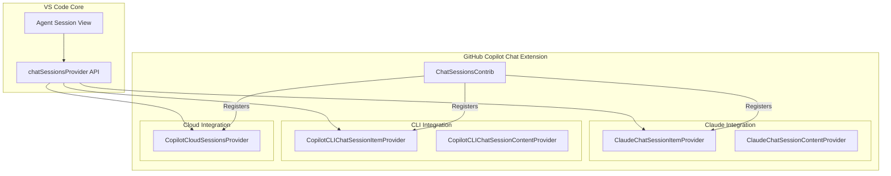

# Chat Sessions and UI Architecture

This document describes the architecture of Chat Sessions and the Chat UI in VS Code, specifically focusing on how the GitHub Copilot Chat extension integrates with the "Agent Session View" and manages chat history.

## Overview

VS Code's Chat architecture distinguishes between **Local Chat History** (managed by VS Code Core) and **Agent Sessions** (managed by Extensions).

*   **Local Chat History**: The standard history of your conversations with Copilot in the Chat view. This is stored locally by VS Code and is not exposed via the `chatSessionsProvider` API.
*   **Agent Sessions**: Specialized chat sessions provided by extensions (e.g., for specific agents like `@claude`, `@workspace` in some contexts, or external services). These are displayed in the "Agent Session View" (often labeled "Chat Sessions" or similar in the UI).

## Proposed API: `chatSessionsProvider`

The "Agent Session View" relies on the `chatSessionsProvider` proposed API (version 3). This API allows extensions to contribute their own list of chat sessions and their content.

### Key Interfaces

The API is defined in `vscode.proposed.chatSessionsProvider.d.ts`.

#### `ChatSessionItemProvider`
Extensions implement this interface to provide a list of available chat sessions.

```typescript
export interface ChatSessionItemProvider {
    /**
     * Event that signals when the list of sessions has changed.
     */
    readonly onDidChangeChatSessionItems: Event<void>;

    /**
     * Returns a list of chat sessions.
     */
    provideChatSessionItems(token: CancellationToken): ProviderResult<ChatSessionItem[]>;

    // ... methods for resolving, deleting, and renaming sessions
}
```

#### `ChatSessionContentProvider`
Extensions implement this interface to provide the actual messages and content for a specific session when the user opens it.

```typescript
export interface ChatSessionContentProvider {
    /**
     * Provides the content (messages) for a given session.
     */
    provideChatSession(session: ChatSessionItem, token: CancellationToken): ProviderResult<ChatSession>;

    // ... methods for handling edits/updates
}
```

## Copilot Implementation

The GitHub Copilot Chat extension uses this API to provide sessions for specific features. The registration is handled by the `ChatSessionsContrib` class in `src/extension/chatSessions/vscode-node/chatSessions.ts`.

### 1. Claude Agent Sessions
*   **Provider**: `ClaudeChatSessionItemProvider`
*   **Type**: `claudeSessionType`
*   **Purpose**: Manages sessions for the Claude agent integration.
*   **Components**:
    *   `ClaudeChatSessionItemProvider`: Lists the sessions.
    *   `ClaudeChatSessionContentProvider`: Hydrates the session content.
    *   `ClaudeChatSessionParticipant`: The chat participant that handles the interaction.

### 2. Copilot CLI Sessions
*   **Provider**: `CopilotCLIChatSessionItemProvider`
*   **Type**: `copilotcli`
*   **Purpose**: Integrates with the GitHub Copilot CLI, allowing users to view and interact with CLI sessions within VS Code.
*   **Components**:
    *   `CopilotCLIChatSessionItemProvider`: Lists CLI sessions.
    *   `CopilotCLIChatSessionContentProvider`: Provides content from the CLI.

### 3. Copilot Cloud Sessions
*   **Provider**: `CopilotCloudSessionsProvider`
*   **Purpose**: Manages cloud-based sessions, potentially related to Pull Requests or other remote agent interactions.
*   **Integration**: Registered via `registerCopilotCloudAgent`.

## Architecture Diagram



## Summary

*   **Yes**, GitHub Copilot Chat uses the `chatSessionsProvider` proposed API.
*   It is used to power specific "Agent Sessions" (Claude, CLI, Cloud), **not** the standard local chat history.
*   The architecture allows for a modular addition of new session types by implementing the `ChatSessionItemProvider` and `ChatSessionContentProvider` interfaces.
