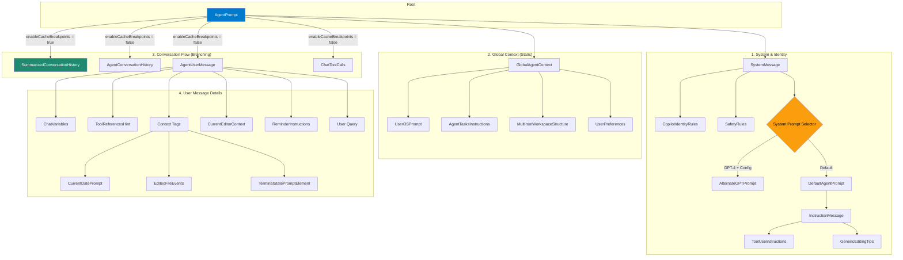

# 10. Prompt Authoring & Engineering

## End-to-End Prompt Generation Flow

This diagram shows how a user's request is transformed into a structured prompt for the Language Model (LLM), leveraging the `@vscode/prompt-tsx` library.

```
┌──────────────────────────────────────────────────────────────────────────────┐
│ USER ACTION                                                                  │
│ Types: "@workspace how does auth work?"                                     │
└────────────────────────────┬─────────────────────────────────────────────────┘
                             │
                             ▼
┌──────────────────────────────────────────────────────────────────────────────┐
│ VSCODE-COPILOT-CHAT - DefaultIntentRequestHandler (The Driver)              │
│ File: src/extension/prompt/node/defaultIntentRequestHandler.ts              │
│                                                                              │
│ 1. Receive Request:                                                         │
│    • Intent: WorkspaceIntent                                                │
│    • Context: History, Variables (#file), User Query                        │
│                                                                              │
│ 2. Prepare Build Context (IBuildPromptContext):                             │
│    • Resolve variables (ChatVariablesCollection)                            │
│    • Gather tool definitions                                                │
│    • Prepare conversation history                                           │
│                                                                              │
│ 3. Invoke Intent's buildPrompt():                                           │
│    • intent.buildPrompt(context, token)                                     │
└────────────────────────────┬─────────────────────────────────────────────────┘
                             │
                             ▼
┌──────────────────────────────────────────────────────────────────────────────┐
│ VSCODE-COPILOT-CHAT - Intent Implementation                                 │
│ File: src/extension/intents/node/workspaceIntent.ts                         │
│                                                                              │
│ 1. Select Root Prompt Component:                                            │
│    • WorkspacePrompt (for @workspace)                                       │
│    • DefaultAgentPrompt (for general chat)                                  │
│                                                                              │
│ 2. Create PromptRenderer:                                                   │
│    • Inject dependencies (Endpoint, Services)                               │
│    • Initialize with Tokenizer for specific model                           │
└────────────────────────────┬─────────────────────────────────────────────────┘
                             │
                             ▼
┌──────────────────────────────────────────────────────────────────────────────┐
│ PROMPT-TSX - Rendering Engine                                               │
│ Library: @vscode/prompt-tsx                                                 │
│                                                                              │
│ 1. Render JSX Tree (React-like):                                            │
│    <WorkspacePrompt>                                                        │
│      <SystemMessage>...</SystemMessage>                                     │
│      <HistoryWithInstructions />                                            │
│      <UserMessage>                                                          │
│         <WorkspaceContext />                                                │
│      </UserMessage>                                                         │
│    </WorkspacePrompt>                                                       │
│                                                                              │
│ 2. Token Management & Pruning:                                              │
│    • Calculate token budget (e.g., 4k, 16k, 128k)                           │
│    • Render elements in priority order                                      │
│    • Prune low-priority elements if budget exceeded                         │
│      (e.g., older history, less relevant context)                           │
└────────────────────────────┬─────────────────────────────────────────────────┘
                             │
                             ▼
┌──────────────────────────────────────────────────────────────────────────────┐
│ FINAL OUTPUT GENERATION                                                      │
│                                                                              │
│ 1. Final Message List (ChatMessage[]):                                      │
│    [                                                                         │
│      { role: "system", content: "You are a..." },                            │
│      { role: "user", content: "Context: ..." },                              │
│      { role: "user", content: "how does auth work?" }                        │
│    ]                                                                         │
│                                                                              │
│ 2. Send to Endpoint:                                                        │
│    • OpenAI / Anthropic / Azure                                             │
└──────────────────────────────────────────────────────────────────────────────┘
```

## Overview

Prompt authoring in this extension is built on **`@vscode/prompt-tsx`**, a library that allows prompts to be composed using TSX (JSX for TypeScript). This brings the component-based architecture of UI development (like React) to prompt engineering.

**Why TSX for Prompts?**
- **Composability**: Reusable components for common instructions (e.g., `<SafetyRules />`, `<CodeBlockFormattingRules />`).
- **Dynamic Rendering**: Prompts change based on available tools, model capabilities, and context.
- **Token Management**: The library handles token counting and "sizing", allowing components to adapt their content or be pruned based on the remaining token budget.
- **Type Safety**: TypeScript ensures that required props (context) are passed correctly.

## Key Components

### 1. Prompt Elements (`PromptElement`)
The building blocks of prompts. Just like React components, they take `props` and `render` other elements or final text.

**Example:**
```tsx
class DefaultAgentPrompt extends PromptElement<DefaultAgentPromptProps> {
    async render(state: void, sizing: PromptSizing) {
        const tools = detectToolCapabilities(this.props.availableTools);

        return (
            <InstructionMessage>
                <Tag name='instructions'>
                    You are a highly sophisticated automated coding agent...
                    {tools[ToolName.ReadFile] && <>You can use the read_file tool...</>}
                </Tag>
                <HistoryWithInstructions history={this.props.history} />
            </InstructionMessage>
        );
    }
}
```

### 2. Prompt Renderer (`PromptRenderer`)
**File:** `src/extension/prompts/node/base/promptRenderer.ts`

The orchestrator that takes a root `PromptElement` and produces the final list of chat messages.
- **Dependency Injection**: Uses VS Code's instantiation service to inject services into prompt elements.
- **Tokenizer Integration**: Connects to the model's tokenizer to ensure accurate counts.
- **Tracing**: Logs the rendered prompt structure for debugging (visible in "Chat: Log Request" output).

### 3. Build Context (`IBuildPromptContext`)
**File:** `src/extension/prompt/common/intents.ts`

The data object passed to the prompt builder containing all necessary state:
- `history`: Previous conversation turns.
- `query`: The user's current message.
- `chatVariables`: Resolved references like `#file:main.ts`.
- `tools`: Available tools and their definitions.
- `workingSet`: Tracked files in the current session.

## Component Composition & Behavior

The `AgentPrompt` component orchestrates the final prompt structure by composing various sub-components based on configuration and conversation state.

### Component Relationship Diagram



### Behavioral Scenarios

The prompt structure changes dynamically based on the configuration and the state of the conversation.

#### 1. Standard Turn (No Caching)
*   **Scenario**: A typical user request where aggressive caching is disabled.
*   **Behavior**:
    *   **History**: `AgentConversationHistory` renders all previous turns linearly.
    *   **User Message**: `AgentUserMessage` renders the current user query, attaching dynamic context like the current time (`CurrentDatePrompt`), active file (`CurrentEditorContext`), and recent file edits (`EditedFileEvents`).
    *   **Tools**: `ChatToolCalls` appends any tool executions and results that happen during this turn.

#### 2. Agent Loop / Caching Mode (`enableCacheBreakpoints = true`)
*   **Scenario**: The agent is performing a multi-step task (looping) or running in a mode that supports prompt caching (to save costs/latency).
*   **Behavior**:
    *   **Consolidated Flow**: Instead of separate history and user message components, `SummarizedConversationHistory` takes over.
    *   **Summarization**: It likely summarizes older turns to maintain context without exceeding token limits.
    *   **Caching**: It inserts `<cacheBreakpoint>` markers (via `GlobalAgentContext` or within the history) to tell the LLM provider to cache the prefix of the prompt.

#### 3. Model-Specific Behavior
*   **Scenario**: Using GPT-4 vs. other models.
*   **Behavior**:
    *   **GPT-4**: If `EnableAlternateGptPrompt` is active, `AlternateGPTPrompt` is used. This injects a specific **"Structured Workflow"** (Plan -> Act -> Verify) into the system message, encouraging the model to create todo lists and think step-by-step.
    *   **Others**: `DefaultAgentPrompt` is used, which provides standard tool definitions and safety guidelines without the enforced workflow.

#### 4. File Editing Feedback Loop
*   **Scenario**: The agent edits a file, and the user sends a follow-up.
*   **Behavior**:
    *   **`EditedFileEvents`**: This component (inside `AgentUserMessage`) detects changes to files since the last turn.
    *   **Diff Awareness**: If the user (or a formatter) modified a file the agent just touched, it injects a warning: *"There have been some changes... be sure to check the current file contents."* This prevents the agent from applying patches to outdated code.

## Context Gathering & Usage

Context is not just appended text; it's structured data fed into the prompt components.

### 1. Variable Resolution
When a user types `#file`, the `ChatVariablesCollection` resolves it to a `IChatRequestVariableValue`.
- **In Prompt**: Rendered by `<ChatVariablesAndQuery />` or `<PromptReferences />`.
- **Optimization**: If the file is too large, the component can decide to summarize it or omit it based on `sizing.tokenBudget`.

### 2. Workspace Context
For `@workspace` queries, the `WorkspaceContext` component fetches relevant symbols and file snippets.
- **File:** `src/extension/prompts/node/panel/workspace/workspaceContext.tsx`
- **Logic**: It uses the `sizing` argument to fetch *just enough* context to fill the remaining context window without overflowing.

### 3. History Management
The `<HistoryWithInstructions />` component renders previous turns.
- **Pruning**: It uses the `passPriority` and `priority` props. If the context limit is reached, older turns are dropped automatically by `prompt-tsx`.

## LLM Characteristics & Influence

The prompt structure adapts dynamically to the specific LLM being used.

### 1. Model Families (GPT vs Claude)
The `PromptRegistry` allows different root prompts for different models.
- **File:** `src/extension/prompts/node/agent/anthropicPrompts.tsx`
- **Mechanism**: `AnthropicPromptResolver` checks the endpoint model ID. If it's `claude-3.5-sonnet`, it uses `Claude45DefaultPrompt` instead of `DefaultAgentPrompt`.
- **Difference**: Claude prompts might use XML tags (`<instructions>`) more heavily, while GPT prompts might rely more on markdown sections.

### 2. Token Limits
`prompt-tsx` provides a `sizing` object to the `render` method:
```typescript
render(state: void, sizing: PromptSizing) {
    // sizing.tokenBudget = remaining tokens
    if (sizing.tokenBudget < 1000) {
        return <ConciseInstructions />;
    }
    return <DetailedInstructions />;
}
```

### 3. Tool Support
Prompts conditionally render instructions based on available tools.
- **Logic**: `detectToolCapabilities` checks if `edit_file`, `run_in_terminal`, etc., are available.
- **Effect**:
    - If `edit_file` is missing: "You don't currently have any tools available for editing files."
    - If `read_file` is present: "You can use the read_file tool to read more context..."

## Response Rendering

Once the prompt is sent, the response is streamed back. The rendering pipeline transforms the raw text into VS Code UI elements.

**Pipeline:**
1.  **Raw Stream**: Text chunks arrive from the LLM.
2.  **ResponseStreamParticipants**: A chain of processors that inspect/modify the stream.
    *   **Linkification**: Converts file paths (`src/main.ts`) into clickable links.
    *   **Code Block Tracking**: Detects code blocks for "Apply in Editor" functionality.
    *   **Edit Survival**: Tracks if suggested edits are kept by the user (for telemetry).
3.  **Markdown Rendering**: The final text is rendered as Markdown in the chat panel.

## Best Practices for Prompt Engineering in this Codebase

1.  **Use Components**: Don't write long string templates. Break instructions into components (e.g., `<EditingRules />`).
2.  **Respect Priorities**: Assign `priority` to critical instructions (`priority={1000}`) so they are never pruned.
3.  **Conditional Rendering**: Always check `this.props.availableTools` before instructing the model to use a tool.
4.  **Model Agnosticism**: Unless necessary, write prompts that work for generic chat models. Use `PromptRegistry` for model-specific overrides.

## Custom Agents (`.agent.md`)

Custom agents allow users to define specialized personas with specific instructions and context. These are defined in `.agent.md` files within the workspace.

### 1. Definition & Parsing
*   **File Format**: `.agent.md` files contain a header (YAML frontmatter) and a body (markdown instructions).
*   **Parsing**: VS Code core parses these files.
*   **Injection**: The parsed content is passed to the extension via the `ChatRequest.modeInstructions2` property (internal API).

### 2. Integration in Prompt
The `AgentPrompt` component handles custom agent instructions dynamically.

**File:** `src/extension/prompts/node/agent/agentPrompt.tsx`

```tsx
private async getAgentCustomInstructions() {
    if (this.props.promptContext.modeInstructions) {
        const { name, content } = this.props.promptContext.modeInstructions;

        // Rendered as a high-priority tag
        return (
            <Tag name='modeInstructions'>
                You are currently running in "{name}" mode. Below are your instructions...
                {content}
            </Tag>
        );
    }
    // ...
}
```

### 3. Combination Strategy
Custom agent instructions are combined with other prompt elements in a specific order:
1.  **Base System Prompt**: "You are an expert AI..." (unless disabled).
2.  **Custom Agent Instructions**: The content from `.agent.md`.
3.  **User Custom Instructions**: From `github.copilot.chat.customInstructions` setting.
4.  **Global Context**: OS, Date, Workspace structure.
5.  **Conversation History**: Previous turns.
6.  **User Query**: The actual question.

This ensures that the custom agent's persona takes precedence over general instructions but still operates within the safety and capability framework of the base agent.
